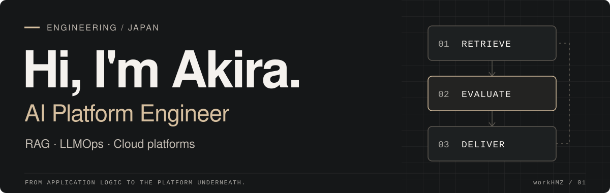
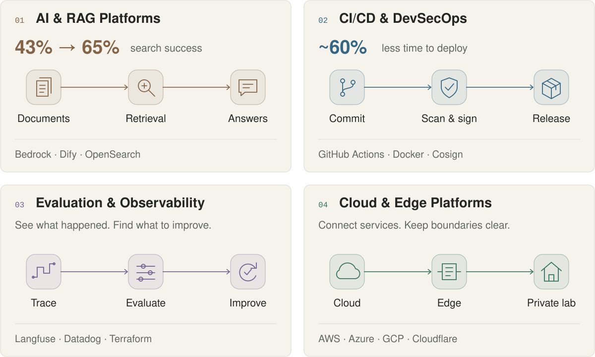
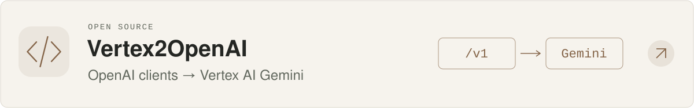
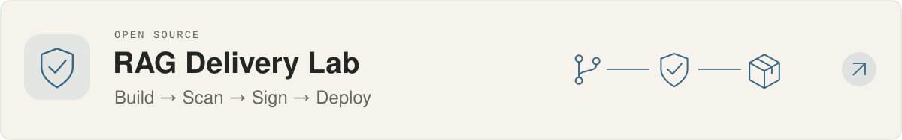
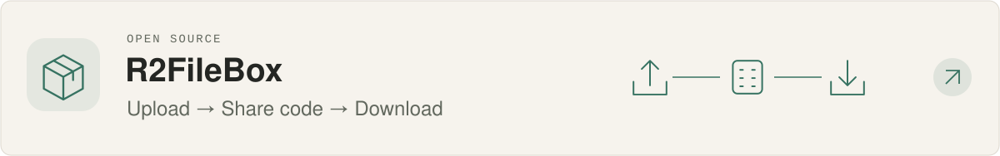
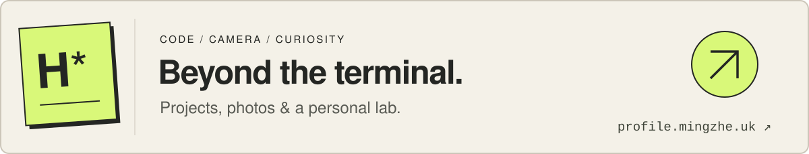

<a href="https://workhmz.github.io/workHMZ/">
  <picture>
    <source media="(prefers-color-scheme: dark)" srcset="assets/readme/cover-dark.svg">
    <source media="(prefers-color-scheme: light)" srcset="assets/readme/cover-light.svg">
    
  </picture>
</a>

**Akira (H.mz)** · AI platforms, open-source tools, and a personal lab.

[**Systems & projects ↗**](https://workhmz.github.io/workHMZ/) · [**Personal site ↗**](https://profile.mingzhe.uk/)

 

## Focus Areas

<picture>
  <source media="(max-width: 600px) and (prefers-color-scheme: dark)" srcset="assets/readme/focus-dark-mobile.svg">
  <source media="(max-width: 600px)" srcset="assets/readme/focus-light-mobile.svg">
  <source media="(prefers-color-scheme: dark)" srcset="assets/readme/focus-dark.svg">
  
</picture>

A few examples behind the diagrams

- **RAG:** Built a pipeline for 10,000+ PDFs, using Langfuse traces to guide chunking and retrieval improvements.
- **Delivery:** Improved shared GitHub Actions workflows through parallel jobs and caching.
- **AI-assisted testing:** Built an Excel → YAML → Playwright platform covering ~5,500 cases, with schema validation and integrity checks to guard against false passes.
- **Cloud & observability:** Operate public services and a private lab; manage GKE monitoring and alerts with Datadog, Terraform and Helm.

 

## Open Source

<a href="https://github.com/workHMZ/vertex2openai-cf">
  <picture>
    <source media="(max-width: 600px) and (prefers-color-scheme: dark)" srcset="assets/readme/project-vertex-dark-mobile.svg">
    <source media="(max-width: 600px)" srcset="assets/readme/project-vertex-light-mobile.svg">
    <source media="(prefers-color-scheme: dark)" srcset="assets/readme/project-vertex-dark.svg">
    
  </picture>
</a>

<a href="https://github.com/workHMZ/aca-ghcr-cicd-lab">
  <picture>
    <source media="(max-width: 600px) and (prefers-color-scheme: dark)" srcset="assets/readme/project-delivery-dark-mobile.svg">
    <source media="(max-width: 600px)" srcset="assets/readme/project-delivery-light-mobile.svg">
    <source media="(prefers-color-scheme: dark)" srcset="assets/readme/project-delivery-dark.svg">
    
  </picture>
</a>

<a href="https://github.com/workHMZ/r2filebox">
  <picture>
    <source media="(max-width: 600px) and (prefers-color-scheme: dark)" srcset="assets/readme/project-r2filebox-dark-mobile.svg">
    <source media="(max-width: 600px)" srcset="assets/readme/project-r2filebox-light-mobile.svg">
    <source media="(prefers-color-scheme: dark)" srcset="assets/readme/project-r2filebox-dark.svg">
    
  </picture>
</a>

Tools & certifications

**Build** — Python · TypeScript · FastAPI · Playwright · JSON Schema 
**Ship** — GitHub Actions · Docker · Kubernetes / GKE · Terraform · Helm 
**Observe** — Langfuse · Datadog · Sentry

AWS Certified Solutions Architect – Professional 
OCI AI Foundations Associate · OCI Foundations Associate

 

<a href="https://profile.mingzhe.uk/"><b>Visit my personal site ↗</b></a>

