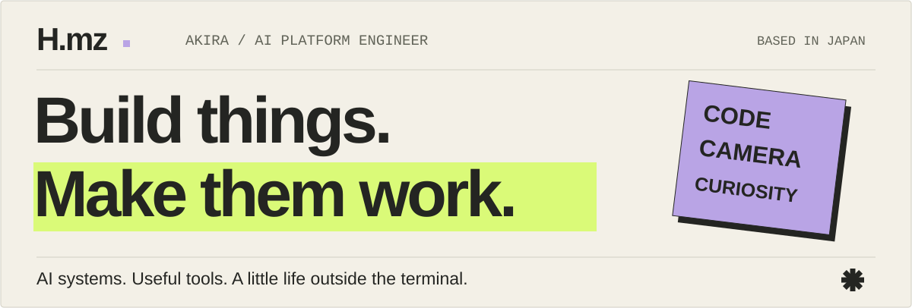
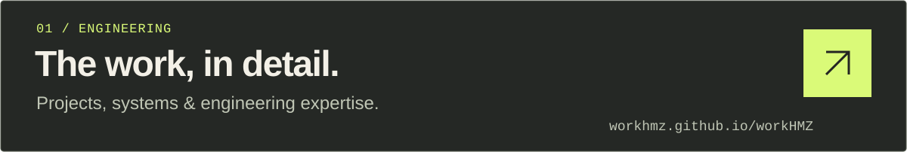
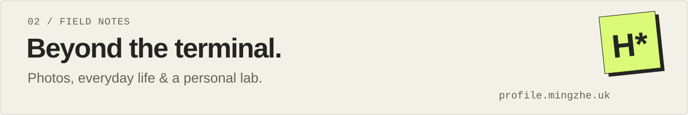
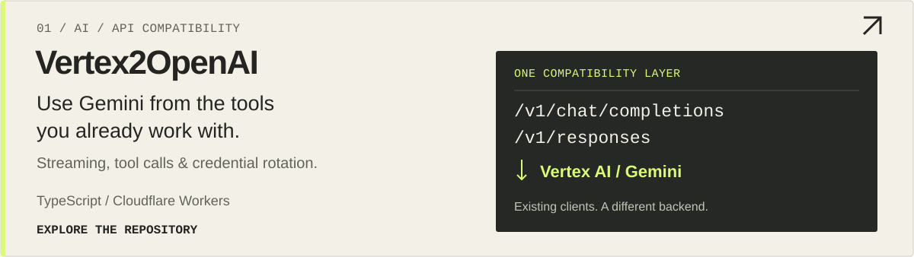
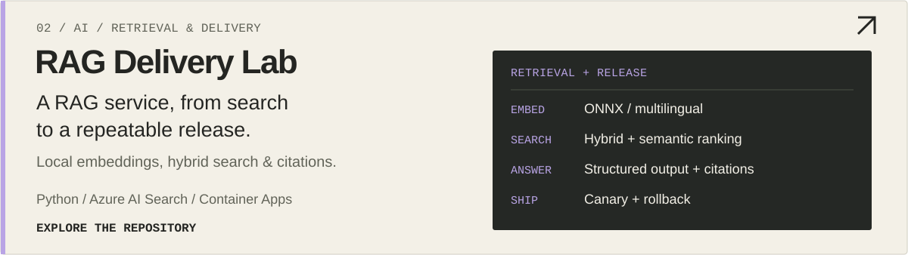
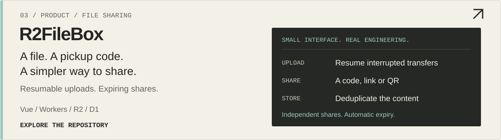

<picture>
  <source media="(max-width: 640px)" srcset="assets/readme/cover-mobile.svg">
  
</picture>

I build AI systems and useful tools, then keep improving them through real use.
My work spans retrieval, delivery and operations. Away from the keyboard, I take photos and tinker with a home lab.

<a href="https://workhmz.github.io/workHMZ/">
  <picture>
    <source media="(max-width: 640px)" srcset="assets/readme/entry-work-mobile.svg">
    
  </picture>
</a>

<a href="https://profile.mingzhe.uk/">
  <picture>
    <source media="(max-width: 640px)" srcset="assets/readme/entry-life-mobile.svg">
    
  </picture>
</a>

## Selected work

Three open-source projects. Each started with a practical problem.

<a href="https://github.com/workHMZ/vertex2openai-cf">
  <picture>
    <source media="(max-width: 640px)" srcset="assets/readme/project-vertex-mobile.svg">
    
  </picture>
</a>

<a href="https://github.com/workHMZ/aca-ghcr-cicd-lab">
  <picture>
    <source media="(max-width: 640px)" srcset="assets/readme/project-rag-mobile.svg">
    
  </picture>
</a>

<a href="https://github.com/workHMZ/r2filebox">
  <picture>
    <source media="(max-width: 640px)" srcset="assets/readme/project-filebox-mobile.svg">
    
  </picture>
</a>

<b>A little more about my work</b>

- **RAG:** Document ingestion, retrieval tuning and evaluation guided by Langfuse traces.
- **Delivery:** Reusable GitHub Actions workflows, container releases and rollback paths.
- **Quality:** AI-assisted test generation with schema validation and artifact integrity checks; monitoring with Datadog, Terraform and Helm.

AWS Certified Solutions Architect – Professional · OCI AI Foundations Associate · OCI Foundations Associate

Chinese / Japanese / English

Build with intent. Keep improving. Stay curious.
